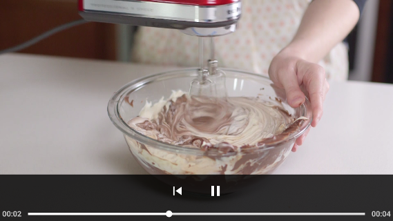

# Bakelicious
Flip through several delicious recipes with detailed step by step instructions including pictures and videos.

*Second project for [Udacity's Android Developer Nanodegree Program](https://eu.udacity.com/course/android-developer-nanodegree-by-google--nd801) (built in partnership with Google).*

## Prerequisites
Confirm [JSON](https://d17h27t6h515a5.cloudfront.net/topher/2017/May/59121517_baking/baking.json) containing recipe data is still accessible online. Otherwise, use a [backup copy](assets/baking.json).

## Built with
- `Retrofit` and `RecyclerView` to download and display recipe data.
- `ExoPlayer` to stream recipe videos.
- `Espresso` to test clicking on recipes. `IdlingResource` used to pause testing until the recipe list is downloaded and loaded into `RecyclerView`.

## Screen captures

|Home screen|Recipe steps
------------|------------
||

Instructions|In landscape video turns fullscreen and media controls fade out
------------|---------------------------------------------------
|

Master/detail flow for tablet|
-----------------------------|
|

Ingredients widget|
------------------|
|

## Credits
[Udacity](https://eu.udacity.com/) - recipe details and videos.

## Licence
This project is licensed under the MIT Licence - see the [LICENCE](LICENCE) file for details.